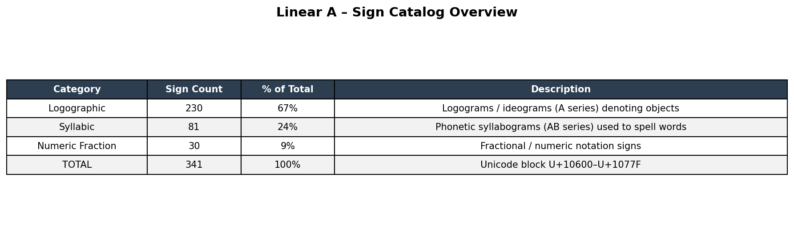
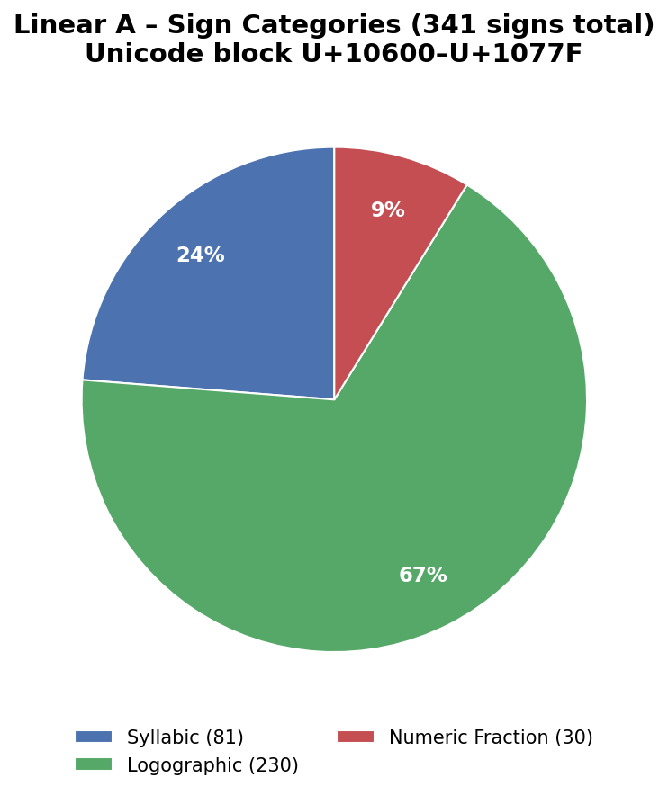
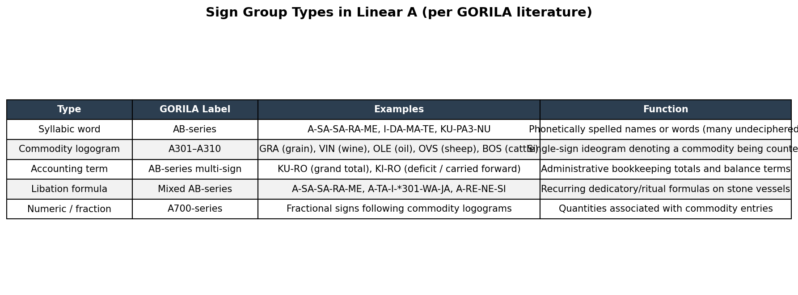
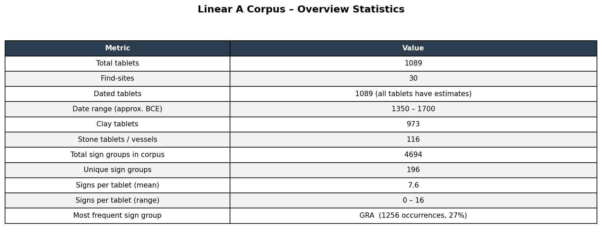
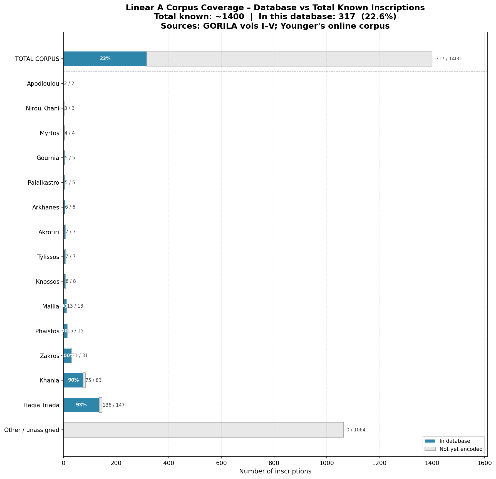
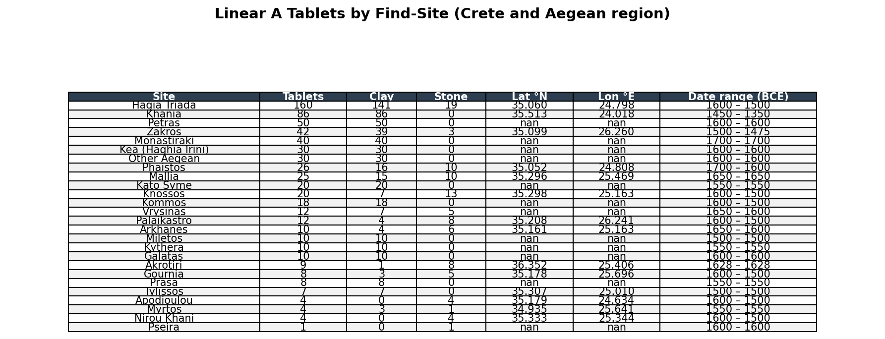
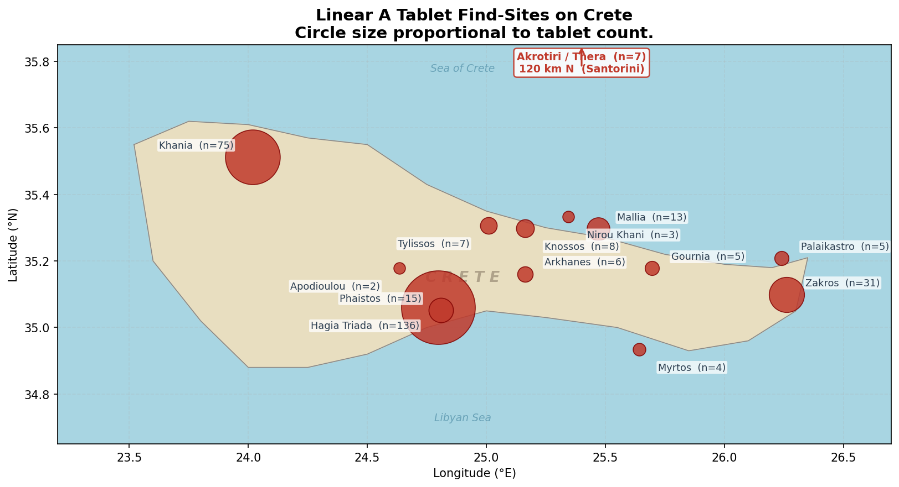
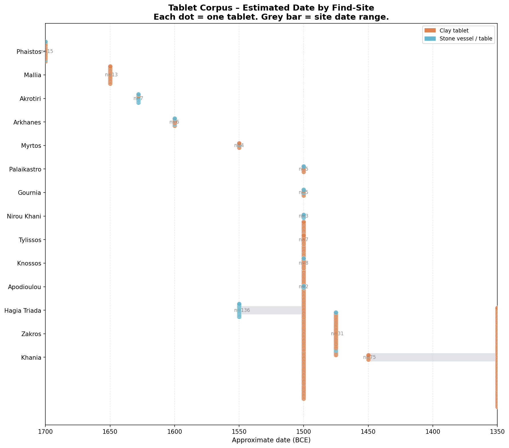
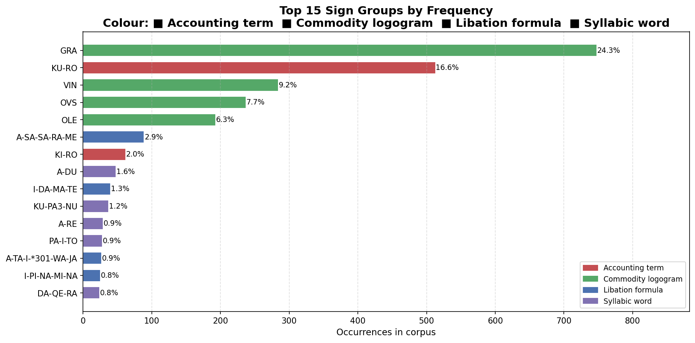
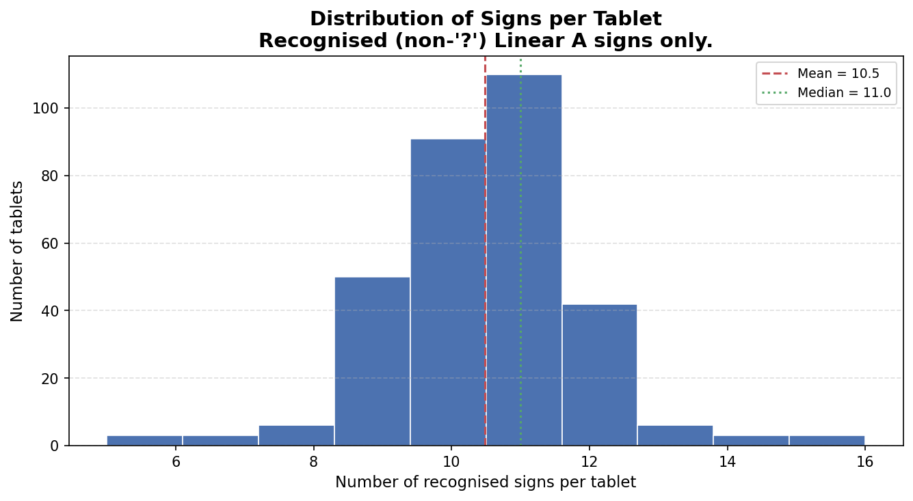

# Linear A Database

A structured database of **Linear A** — an undeciphered writing system used by the Minoan civilisation on Crete, ca. **1800–1450 BCE**. No one can read it. This project encodes what we have into a machine-readable format.

**317 tablets** from **14 archaeological sites** | **341 Unicode signs** | **~22.6 %** of all known Linear A inscriptions

---

## 1 — What Is This?

Linear A is the main script of Bronze Age Crete. It appears on clay accounting tablets, stone libation vessels, and a handful of other objects. Despite a century of study, the underlying language remains unknown. The writing system uses three types of signs:





- **Syllabic** (81 signs) — phonetic syllabograms, values inferred from the later Linear B script
- **Logographic** (230 signs) — ideograms for objects and commodities (grain, wine, oil, livestock)
- **Numeric/fraction** (30 signs) — quantity notation

These signs combine into **sign groups** — the "words" on each tablet:



---

## 2 — The Database at a Glance

This database contains **317 inscriptions** drawn from GORILA vols I–V and Younger's transliteration corpus.



### Coverage

317 of ~1,400 known inscriptions = **~22.6 %**. Coverage is high for the major Cretan archives and zero for the long tail of minor sites, sealings, and non-Cretan finds.



---

## 3 — Geographic Distribution

All 13 Cretan sites plus Akrotiri (Santorini). Hagia Triada dominates with ~45 % of the corpus.





Note that the above distribution covers 317 of ~1,400 known inscriptions = ~22.6 %
---

## 4 — Temporal Distribution

Most tablets cluster around **1500 BCE** (Late Minoan I). Khania is the outlier — its archive dates to ~1350 BCE, over a century later than the rest.



---

## 5 — Sign Group Frequencies

**GRA** (grain) and **KU-RO** (grand total) dominate — reflecting that most tablets are commodity accounting records. Personal names (A-DU, KU-PA3-NU, DA-QE-RA) appear among the top syllabic entries.



---

## 6 — Signs per Tablet

Tablets typically carry **8–13 recognised signs**. The narrow range reflects formulaic accounting: name + commodity + quantity + total.



---

## Quick Start

```bash
pip install -r requirements.txt
python main.py
```

Outputs: `data/lina_database_raw.csv`, `data/lina_database_clean.csv`, `data/lina_report.xlsx`, `data/figures/*.png`

---

## Schema

| Column | Type | Example |
|---|---|---|
| `tablet_id` | str | `HT 1` |
| `site` | str | `Hagia Triada` |
| `date_est` | Int64 | `-1500` |
| `material` | str | `clay` / `stone` |
| `transliteration` | str | `A-DU GRA KU-RO` |
| `sign_groups` | str | `A-DU\|GRA\|KU-RO` |
| `sign_sequence_unicode` | str | Unicode Linear A characters |
| `sign_sequence_ids` | str | `3,26,52,11` |
| `sign_group_count` | int | `3` |
| `sign_count` | int | `5` |

---

## Assumptions & Limitations

| Area | Note |
|---|---|
| Coverage | 22.6 % of ~1,400 known inscriptions. Statistics may not generalise to the full corpus. |
| Phonetic values | Extrapolated from Linear B — ~30 % of signs have no agreed value. Treat as hypothetical. |
| Logograms | Commodity readings (GRA = grain, VIN = wine) are scholarly consensus, not proven. |
| Dates | Broad estimates (±50–100 years). Akrotiri fixed to 1628 BCE (volcanic destruction). |
| Cleaning | Passthrough — no deduplication or normalisation applied yet. |
| Transliteration | Damage markers stripped; star-notation signs excluded from counts. |

---

## Sources

- Godart & Olivier (1976–1985). *GORILA*, vols I–V. Paris: Geuthner.
- Younger, J.G. *Linear A Texts in Transliteration* (online).
- Unicode Standard — Linear A block U+10600–U+1077F.

