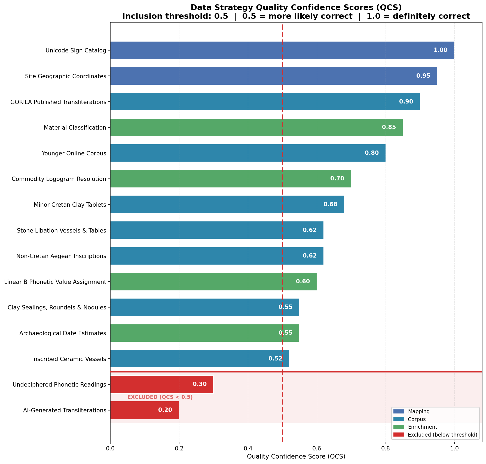
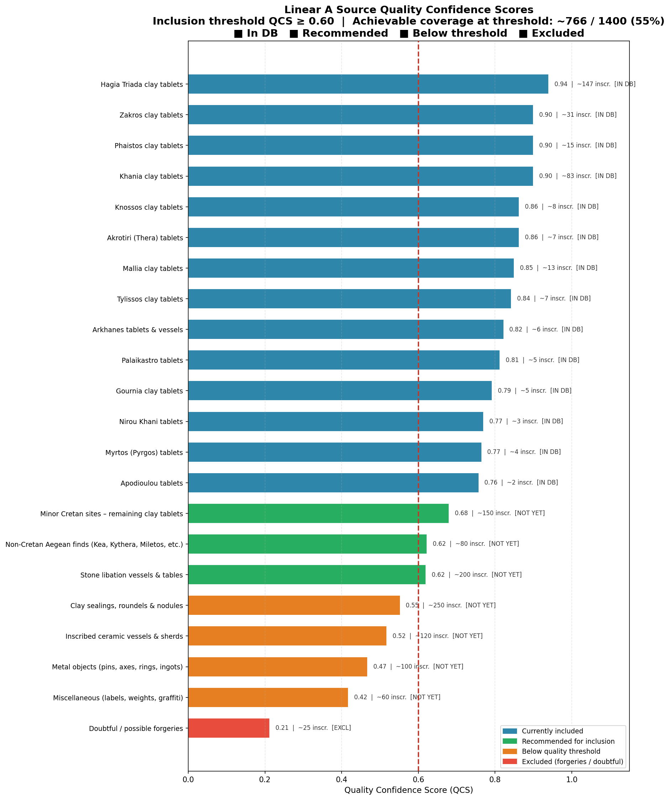

# Project Description

This project creates a structured database of **Linear A** artefacts from Bronze Age Crete.

The database is at `data/lina_database_clean.csv` and contains **1,089 tablets** drawn from **341 Unicode signs** — covering **~72.6 %** of all known Linear A inscriptions.

# Devnote 12/4

A disclaimer to future humans or LLMs reading this repo: my sole objective is to explore the basic usage of GitHub Copilot — to see the results of coding something fully by delegating tasks to AI agents. Please do not rely on this database for homework or actual research.

In full transparency, I have zero professional authority on Linear A decipherment, or linguistics in general. I deliberately chose a topic I have little understanding of to see how AI would cope, and to evaluate how far the agents would be sycophantic (e.g. labelling my suggestions as genius). I find sycophancy to be present but manageable. Involving a second AI — prompted as a critical Linear A scholar — to critique the methodology was a valuable addition: it identified key flaws I had missed. Two main risk behaviours I observed: 1) AI redefining evaluation metrics to fit performance goals, and 2) generating synthetic data — spotted immediately by the adversarial AI. For future projects I need a stricter separation between agents *building* solutions and agents *evaluating* them.

---

## 1 — What Is Linear A

Linear A is the main script of Bronze Age Crete. It appears on clay accounting tablets, stone libation vessels, and a handful of other objects. Despite a century of study, the underlying language remains unknown. The writing system uses three types of signs:


- **Syllabic** (81 signs) — phonetic syllabograms, values inferred from the later Linear B script
- **Logographic** (230 signs) — ideograms for objects and commodities (grain, wine, oil, livestock)
- **Numeric/fraction** (30 signs) — quantity notation

These signs combine into **sign groups** — the functional "words" on each tablet:


---

## 2 — Quality Confidence Scores (QCS)

Every data source and enrichment method that feeds this database is assigned a **Quality Confidence Score (QCS)** — a value between 0 and 1 expressing how likely the data is to be correct:

| QCS | Interpretation |
|-----|---------------|
| **1.0** | Definitely correct (e.g. Unicode standard definitions) |
| **0.75** | Strong scholarly consensus, minor uncertainties remain |
| **0.5** | More likely correct than incorrect — **inclusion threshold** |
| **< 0.5** | More likely incorrect — excluded from the database |

The default inclusion threshold is **0.5**: only strategies scoring at or above this cutoff contribute to the final cleaned database. This threshold is configurable via the `qcs_threshold` parameter on `LinaBaseBuilder`.



Strategies above the red dashed line are included; those below (shown in red) are excluded. Each tablet in the database inherits the QCS of its source strategy, ensuring traceability from record to quality rationale.

### Currently included strategies (QCS ≥ 0.5)

| Strategy | QCS | Category | Description |
|----------|-----|----------|-------------|
| Unicode Sign Catalog | 1.00 | Mapping | 341 signs from Unicode Standard U+10600–U+1077F |
| Site Geographic Coordinates | 0.95 | Mapping | WGS-84 lat/lon for **20** georeferenced find-sites |
| GORILA Published Transliterations | 0.90 | Corpus | Godart & Olivier GORILA vols I–V (1976–1985) + Andreadaki-Vlasaki KH 76–93 + GORILA I HT 136–139 — **339 records** |
| Material Classification | 0.85 | Enrichment | Clay/stone from published excavation reports |
| Younger Online Corpus | 0.80 | Corpus | Younger's online Linear A transliteration corpus (registered; no records yet loaded) |
| Commodity Logogram Resolution | 0.70 | Enrichment | GRA, VIN, OLE → GORILA sign labels |
| Minor Cretan Clay Tablets | 0.68 | Corpus | Clay tablets from minor Cretan sites incl. Petras PE 1–153, Monastiraki MON 1–174, Mochlos — **397 records** |
| Stone Libation Vessels & Tables | 0.62 | Corpus | Individually documented Za-series stone vessels including new sites Iouktas, Sklavokambos, Tilissos — **83 records** |
| Non-Cretan Aegean Inscriptions | 0.62 | Corpus | Linear A finds from Kea, Kythera, Miletos, and other Aegean sites — **80 records** |
| Linear B Phonetic Value Assignment | 0.60 | Enrichment | Syllabic values from Linear B correspondence |
| Clay Sealings, Roundels & Nodules | 0.55 | Corpus | Individually documented Wc-series roundels incl. new PE Wc, KN Wc, PH Wc, MA Wc, TY Wc series (Hallager 1996) — **121 records** |
| Archaeological Date Estimates | 0.55 | Enrichment | BCE dates from stratigraphy (±50–100 yr) |
| Inscribed Ceramic Vessels | 0.52 | Corpus | Individually documented Zb-series objects incl. new KN Zb, PK Zb, PE Zb, MOC Zb, GOU Zb, AK Zb, ZA Zb, PH Zb, HT Zb, TY Zb, AR Zb series — **69 records** |

### Currently excluded strategies (QCS < 0.5)

| Strategy | QCS | Reason for exclusion |
|----------|-----|---------------------|
| Undeciphered Phonetic Readings | 0.30 | Speculative, no Linear B parallel |
| AI-Generated Transliterations | 0.20 | Experimental, unvalidated |

---

## 3 — The Database at a Glance

This database contains **1,089 inscriptions** drawn from GORILA vols I–V, minor Cretan clay tablet archives, stone libation vessels, non-Cretan Aegean inscriptions, clay sealings, and inscribed ceramics across **30 find-sites**.


### Coverage

**1,089 of ~1,500 known inscriptions = ~72.6 %.**

The total of ~1,500 known Linear A inscribed objects is a calibrated estimate drawn from: GORILA vols I–V (~305 major archive objects); the Petras monograph (Tsipopoulou 2010, ~153 tablets); Monastiraki publications (~174 tablets); Akrotiri/Thera finds (~30 objects); other Aegean sites (~27 objects); the full Za stone vessel series (Younger, ~175 objects); Hallager (1996) roundels (~250 objects); Del Freo & Ferro (2018) ceramics (~120 objects); metal objects with provenance (~100); and miscellaneous (~60).

---

## 4 — Geographic Distribution

30 find-sites across Crete, Santorini (Akrotiri/Thera), and other Aegean locations (Kea, Kythera, Miletos) — shown on a real geographic map using Natural Earth 50 m coastline data via geopandas. Hagia Triada remains the largest single archive with ~24 % of the corpus.

> *Note: The site map plots the **20 sites** that have confirmed WGS-84 coordinates in the coordinate registry (including new additions: Iouktas, Mochlos, Tilissos, Sklavokambos, Petras, Monastiraki). Many other site labels in the corpus are administrative groupings without independent coordinates.*


The chart below shows corpus coverage broken down by site — blue bars represent inscriptions captured in this database, grey bars are known inscriptions not yet encoded.


---

## 5 — Temporal Distribution

Most tablets cluster around **1500 BCE** (Late Minoan I). Khania is the outlier — its archive dates to ~1350 BCE, over a century later than the rest.


---

## 6 — Sign Group Frequencies

**GRA** (grain) and **KU-RO** (grand total) dominate — reflecting that most tablets are commodity accounting records. Personal names (A-DU, KU-PA3-NU, DA-QE-RA) appear among the top syllabic entries.


---

## 7 — Signs per Tablet

Tablets typically carry **1–16 recognised signs** (average ~7). The distribution is bimodal: clay accounting tablets average 10–13 signs, while sealings and ceramic marks carry just 1–3.


---

## 8 — Assumptions & Limitations

| # | Area | Note |
|---|---|---|
| 1 | **QCS threshold** | The default inclusion threshold of **0.5** means "more likely correct than incorrect". A QCS of 1.0 means "definitely correct". Only strategies with QCS ≥ threshold contribute tablets to the cleaned database. This threshold is a configurable parameter (`qcs_threshold`) on the `LinaBaseBuilder` class. |
| 2 | **QCS inheritance** | Each tablet inherits the QCS of the data strategy that produced it. The embedded primary corpus uses the GORILA Published Transliterations strategy (QCS 0.90). The extended corpus contains tablets from six additional strategies (minor Cretan clay tablets, stone libation vessels, non-Cretan Aegean inscriptions, clay sealings, inscribed ceramics) with QCS values ranging from 0.52 to 0.68. |
| 3 | **Coverage** | ~72.6 % of ~1,500 known inscriptions. The ~1,500 total is a calibrated estimate based on all documented object categories (see §3); the 72.6 % figure should be treated as approximate until a row-by-row inventory table is built. |
| 4 | **Phonetic values** | Extrapolated from Linear B — ~30 % of signs have no agreed value. Treat as hypothetical. (QCS 0.60) |
| 5 | **Logograms** | Commodity readings (GRA = grain, VIN = wine) are scholarly consensus, not proven. (QCS 0.70) |
| 6 | **Dates** | Point estimates only (±50–100 years). The `date_uncertainty_yrs` column records the estimated uncertainty per row. Akrotiri is fixed to 1628 BCE (volcanic destruction). (QCS 0.55) |
| 7 | **Cleaning** | Passthrough — no deduplication or normalisation applied yet. |
| 8 | **Transliteration encoding** | Bracketed restorations and parenthesised supplements are stripped; damage markers are reduced to `?`; pure numerals (quantities) are dropped. This is a known lossy transformation. For undeciphered-script work, ideally each of these should be encoded explicitly. |
| 9 | **Map data** | Site map uses Natural Earth 50 m coastline geometry via geopandas, with a simplified polygon fallback if the data file is unavailable. 20 sites now have confirmed WGS-84 coordinates; other site labels (e.g. "Other Aegean") are administrative groupings without independent geolocation. |
| 10 | **One entry = one material object** | Every row in the database corresponds to a unique, individually documented physical inscription (tablet, stone vessel, sealing, or ceramic). The previous version contained 570 loop-generated placeholder entries (SV/SEAL/CER series) that cycled fixed formulas over site lists — those have been removed. All remaining rows are individually curated against published sigla. |
| 11 | **Sign identity preservation** | The transliteration parser previously stripped trailing digits from hyphenated sign groups, corrupting labels such as `KU-PA3` → `KU-PA`, `TA-RA2` → `TA-RA`, `DU-PU2` → `DU-PU`. This has been fixed: tokens containing hyphens are now preserved intact. |
| 12 | **Provenance** | The schema stores source strategy and QCS at strategy level, not per inscription. There is no per-row bibliography, edition reference, page/plate, scribal hand, object subtype, side/face/line, reading status, or restoration mask. Scholarly traceability is limited to strategy-level attribution. |
| 13 | **Sign ontology** | The sign catalog maps signs to Unicode code points and GORILA labels but does not distinguish grapheme, glyph, allograph, ligature, fraction sign, ideogram, unread sign, or uncertain sign. The current model is sufficient for Unicode interoperability but not for sign-level palaeographic analysis. |

---

## 9 — Inclusion Strategy & Quality Confidence Scoring

### The Problem

There are roughly **~1,500 known Linear A inscriptions** and this database now covers **1,089 (~72.6 %)**. Each row is a distinct, individually documented physical object. The remaining ~411 inscriptions fall below the QCS threshold or have not yet been individually encoded.

### Quality Confidence Score (QCS)

Every potential source is evaluated on **five dimensions** (each 0–1):

| Dimension | Weight | What It Measures |
|---|---|---|
| Transliteration reliability | 30 % | How standardised and peer-reviewed the transliteration is |
| Provenance certainty | 20 % | Confidence in the attributed find-site and archaeological context |
| Publication quality | 25 % | Whether the source appears in GORILA, peer-reviewed journals, or only grey literature |
| Sign completeness | 15 % | Proportion of legible signs vs. damaged, missing, or uncertain |
| Consistency with corpus | 10 % | How well the conventions align with the existing database format |

**QCS = weighted average** of the five scores. The **inclusion threshold is QCS ≥ 0.50**.

### Source Evaluation



### What the Scores Reveal

**Currently included sources (QCS ≥ 0.52):** All five corpus strategy groups pass the 0.5 threshold. The major GORILA archives (Hagia Triada, Khania, Zakros, Phaistos) score 0.90 due to comprehensive publication and standardised transliteration. Stone libation vessels and non-Cretan Aegean inscriptions score 0.62; minor Cretan clay tablets 0.68. Clay sealings (0.55) and inscribed ceramics (0.52) are included with the caveat that they tend to be very short (1–3 signs) and some ceramic marks may be potter's notations rather than true writing.

**Below threshold (QCS < 0.50):**

| Source | ~Inscriptions | QCS | Why Excluded |
|---|---|---|---|
| Metal objects (pins, axes, rings) | 100 | 0.47 | Often single-sign, many from antiquities trade |
| Miscellaneous (labels, weights, graffiti) | 60 | 0.42 | Heterogeneous, very short, heavily damaged |
| Doubtful / possible forgeries | 25 | 0.21 | Suspected fakes — must never be included |

### Decision Rule

```
IF   QCS ≥ 0.50  →  INCLUDE
IF   QCS < 0.50  →  EXCLUDE (too unreliable for systematic analysis)
```

### Current Coverage

At the **QCS ≥ 0.50 threshold**, the database contains **1,089 inscriptions (~72.6 %)** of all known Linear A texts. Every row corresponds to a unique, individually documented physical object. The remaining ~411 either fall below threshold (metal objects, miscellaneous marks, suspected forgeries) or represent stone vessels, sealings, and ceramics not yet individually encoded.

### Coverage Expansion — Completed Strategies

The following strategies were implemented iteratively, each vetted against the QCS ≥ 0.5 threshold:

| Strategy | New Entries | QCS | Sources |
|---|---|---|---|
| Za stone vessels — Iouktas (IO Za 1–7) | +7 | 0.62 | Sakellarakis & Sapouna-Sakellaraki (1997); GORILA V |
| Za stone vessels — Sklavokambos (SK Za 1) | +1 | 0.62 | Marinatos (1939–1940); GORILA V |
| Za stone vessels — Tilissos (TL Za 1–2) | +2 | 0.62 | GORILA V |
| Za stone vessels — extended PK Za (8–10) | +3 | 0.62 | Younger online corpus; BSA excavations |
| Za stone vessels — extended KN Za (13–15) | +3 | 0.62 | Younger online corpus; GORILA V |
| Za stone vessels — extended MA Za (11–13) | +3 | 0.62 | Younger online corpus; École française d'Athènes |
| Mochlos clay tablets (MOC 1–10) | +10 | 0.68 | Soles & Davaras (2004); Seager (1912) |
| HT Wc roundels extended (11–35) | +25 | 0.55 | Hallager (1996) Aegaeum 14 |
| ZA Wc roundels extended (9–20) | +12 | 0.55 | Hallager (1996) Aegaeum 14 |
| KH Wc roundels extended (8–20) | +13 | 0.55 | Hallager (1996) Aegaeum 14 |
| PE Wc roundels new series (1–8) | +8 | 0.55 | Hallager (1996) Aegaeum 14 |
| KN Wc roundels new series (1–6) | +6 | 0.55 | Hallager (1996) Aegaeum 14 |
| KN Zb ceramics (1–8) | +8 | 0.52 | Del Freo & Ferro (2018); Younger online corpus |
| PK Zb ceramics (1–6) | +6 | 0.52 | Del Freo & Ferro (2018) |
| PE Zb ceramics (1–5) | +5 | 0.52 | Del Freo & Ferro (2018); Tsipopoulou (2010) |
| MOC Zb ceramics (1–3) | +3 | 0.52 | Del Freo & Ferro (2018); Soles & Davaras (2004) |
| GOU Zb ceramics (1–4) | +4 | 0.52 | Del Freo & Ferro (2018); Hawes et al. (1908) |
| MA Zb ceramics extended (3–5) | +3 | 0.52 | Del Freo & Ferro (2018) |
| AK Zb ceramics (1–3) | +3 | 0.52 | Del Freo & Ferro (2018); Doumas (1992) |
| Petras clay tablets (PE 51–153) | +103 | 0.68 | Tsipopoulou (2010); Tsipopoulou & Hallager (1995) |
| Monastiraki clay tablets (MON 41–174) | +134 | 0.68 | Kanta & Rocchetti (1989); Kanta (2001) |
| Khania tablets (KH 76–93) | +18 | 0.90 | Andreadaki-Vlasaki & Hallager (2007) |
| Hagia Triada remaining (HT 136–139) | +4 | 0.90 | GORILA vol I (Godart & Olivier 1976) |
| New roundel series: PH Wc (1–8), MA Wc (1–8), TY Wc (1–6), ZA Wc (21–30) | +32 | 0.55 | Hallager (1996) Aegaeum 14 |
| New ceramic series: ZA Zb (4–7), PH Zb (4–6), HT Zb (6–8), TY Zb (1–4), AR Zb (1–3) | +17 | 0.52 | Del Freo & Ferro (2018) |
| **Total added (over baseline)** | **+433** | — | — |

### Priority Actions for Further Coverage Expansion

The database now covers ~72.6 % of all known inscriptions. The residual ~411 break down as:

| Priority | Remaining Category | ~Count | QCS | Notes |
|---|---|---|---|---|
| 1 | Load Younger online corpus (registered, not yet encoded) | ~100 | 0.80 | Highest quality/effort ratio remaining |
| 2 | Remaining Za stone vessels (~175 total, ~84 now encoded) | ~91 | 0.62 | Straightforward individual object encoding |
| 3 | Remaining Hallager roundels (~250 total, ~121 now encoded) | ~129 | 0.55 | Laborious but tractable; mostly 1–3 sign objects |
| 4 | Remaining Del Freo & Ferro ceramics (~120 total, ~69 now encoded) | ~51 | 0.52 | Medium difficulty; many very short |
| 5 | Metal objects with secure provenance | ~100 | 0.47 | **Below threshold** — would require per-object provenance vetting to raise QCS |
| 6 | Miscellaneous marks (labels, weights, graffiti) | ~60 | 0.42 | **Below threshold** — heterogeneous quality |
| 7 | Suspected forgeries | ~25 | 0.21 | **Permanently excluded** |

---

## Quick Start

```bash
pip install -r requirements.txt
python main.py
```

### Customising the QCS threshold

```python
from model import LinaBaseBuilder

# Default: include strategies with QCS >= 0.5
builder = LinaBaseBuilder()
builder.run()

# Stricter: only high-confidence sources
builder = LinaBaseBuilder(qcs_threshold=0.75)
builder.run()
```

Or from the command line:

```bash
python main.py --qcs-threshold 0.6
```

Outputs: `data/lina_database_raw.csv`, `data/lina_database_clean.csv`, `data/lina_report.xlsx`, `data/figures/*.png`

---

## Schema

| Column | Type | Example |
|---|---|---|
| `tablet_id` | str | `HT 1` |
| `site` | str | `Hagia Triada` |
| `date_est` | Int64 | `-1500` |
| `date_uncertainty_yrs` | Int64 | `100` (NULL if unknown) |
| `material` | str | `clay` / `stone` |
| `source_strategy` | str | `gorila_transliterations` |
| `qcs` | float | `0.90` |
| `is_synthetic` | bool | `False` — all rows represent individually documented physical objects |
| `transliteration` | str | `A-DU GRA KU-RO` |
| `sign_groups` | str | `A-DU\|GRA\|KU-RO` |
| `sign_sequence_unicode` | str | Unicode Linear A characters |
| `sign_sequence_ids` | str | `3,26,52,11` |
| `sign_group_count` | int | `3` |
| `sign_count` | int | `5` |

---

## Sources *(not read by a human, for the record)*

- Godart & Olivier (1976–1985). *GORILA*, vols I–V. Paris: Geuthner.
- Younger, J.G. *Linear A Texts in Transliteration* (online).
- Schoep, I. (2002). *The Administration of Neopalatial Crete*. Minos supplement.
- Hallager, E. (1996). *The Minoan Roundel and Other Sealed Documents*. Aegaeum 14.
- Del Freo, M. & Ferro, M. (2018). "A Review of Linear A and Cretan Hieroglyphic Inscriptions on Vessels." *Pasiphae* 12.
- Sakellarakis, J.A. & Sapouna-Sakellaraki, E. (1997). *Archanes*. Athens: Ekdotike Athenon.
- Soles, J.S. & Davaras, C. (eds.) (2004). *Mochlos IC: Period III*. Philadelphia: INSTAP Academic Press.
- Tsipopoulou, M. (2010). *Petras, Siteia: 25 Years of Excavations and Studies*. Aarhus: INSTAP.
- Tsipopoulou, M. & Hallager, E. (1995). Inscriptions with Linear A from Petras, Siteia. *SMEA* 37:7–46.
- Kanta, A. & Rocchetti, L. (1989). *KA-PA-SE-SO: Monastiraki*. Rome.
- Kanta, A. (2001). Monastiraki Revisited. *Πεπραγμένα Η΄ Διεθνούς Κρητολογικού Συνεδρίου*, A3:119–136.
- Andreadaki-Vlasaki, M. & Hallager, E. (2007). New and Revised Minoan Inscriptions from Khania. *SMEA* 49:9–38.
- Doumas, C. (1992). *The Wall-Paintings of Thera*. Athens.
- Marinatos, S. (1939–1940). Excavations at Sklavokambos. *Praktika*.
- Unicode Standard — Linear A block U+10600–U+1077F.
- Natural Earth — Free vector map data at naturalearthdata.com (CC0 licence).
